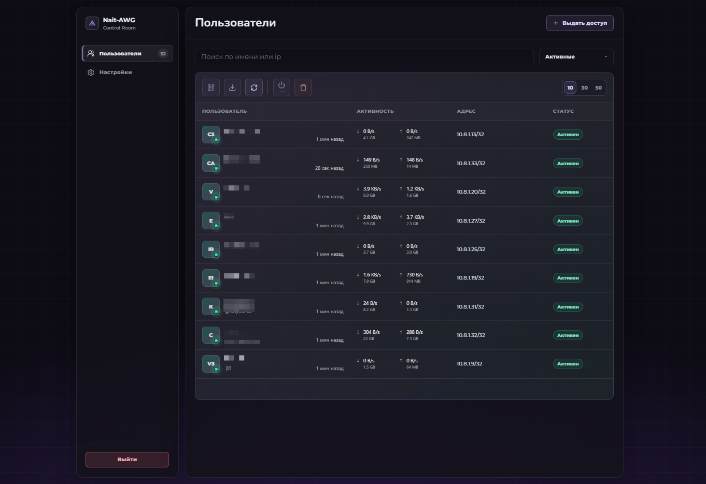
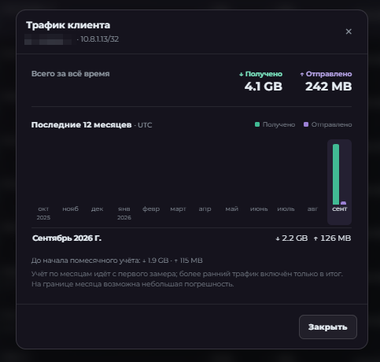
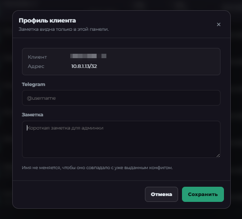
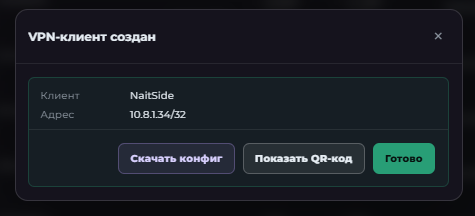
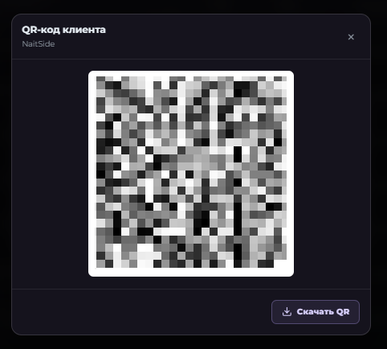

# Nait-AWG

```bash
curl -fsSL https://raw.githubusercontent.com/NaitSide/Nait-AWG/main/install.sh | sudo bash
```

> **Альфа-тестирование.** Пока используйте панель на отдельном сервере, а не на рабочей VPN-ноде.

Уже развернули AmneziaWG через **AmneziaVPN Self-hosted**, но выдавать доступы через приложение неудобно? Nait-AWG добавляет веб-панель для клиентов: список подключений, выдачу конфигов и QR-кодов, включение и отключение доступа, статистику трафика и экспорт резервной копии.

Есть два пути: добавить панель к уже установленному AmneziaWG через пункт 1 или установить AmneziaWG 3.1 и панель вместе на чистом VPS через пункт 2. Во втором случае предварительная установка через приложение AmneziaVPN и передача ему SSH-ключей не нужны.

При запуске `install.sh` показывает меню: **1 — только веб-панель**, **2 — AmneziaWG 3.1 + веб-панель**, **3 — обновление панели** и **4 — сброс логина и пароля**. Пункт 2 использует официальный Docker-образ AmneziaWG из архива внутри проекта с закреплённой контрольной суммой: скачивание образа из Docker Hub и авторизация там не нужны. Он создаёт новые ключи и пустую ноду без клиентов, затем устанавливает нашу панель. При обнаружении VPN, контейнеров или прежней установки он останавливается, ничего не заменяя. Перед началом показывается пояснение: используется официальный образ разработчиков Amnezia, а установщик добавляет веб-интерфейс Nait-AWG. Docker и недостающие системные пакеты устанавливаются из Ubuntu, как раньше. [Подробности совместной установки и восстановления после ошибки](docs/fresh-install.md).

Режим установки из пункта 1 добавляет **только панель** к уже работающему AmneziaWG 3.1. Он не устанавливает VPN-движок и не перезапускает его контейнер. Перед установкой проверяет совместимость и останавливается, если что-то не совпадает. Режим обновления сохраняет пользователей, пароль администратора, порт, сертификат и настройки; контейнер VPN также не перезапускается. Если исходники уже скачаны, проверку без установки можно выполнить командой `sudo bash install.sh audit` из каталога проекта.

Сейчас поддерживается Ubuntu 24.04 x86_64. Во время установки скрипт предложит найденный публичный IPv4 и свободный порт веб-панели в квадратных скобках: нажмите Enter, чтобы принять предложенные значения, или введите свои. Пароль администратора генерируется автоматически: 12 символов, включая заглавные и строчные буквы, цифры и спецсимволы. После успешной установки терминал покажет адрес панели, логин `admin` и пароль. Сохраните реквизиты и смените пароль в настройках. Панель откроется по адресу вида `https://IP:ПОРТ/` с самоподписанным сертификатом. Если UFW включён, установщик откроет в нём выбранный TCP-порт. Отдельный сетевой экран хостинга при необходимости настройте в панели провайдера.

На экране установки и обновления показываются этапы на русском. Подробный вывод установки пакетов Ubuntu, загрузки Docker-образа и библиотек сохраняется в отдельный файл `/var/log/nait-awg-install.XXXXXX.log`: его точный путь выводится при запуске, доступ к файлу есть только у root. При ошибке такого этапа установка останавливается и показывает последние сообщения и путь к логу. Например, просмотреть его можно через `sudo less /var/log/nait-awg-install.XXXXXX.log`, подставив выведенный путь. Пароли, генерация ключей, содержимое конфигов и интерактивные ответы не направляются в этот журнал; он не является записью всей терминальной сессии. Лог сохраняется после завершения или ошибки установки.

Забыли пароль? Подключитесь к серверу по SSH, повторите команду из начала README и выберите пункт **4**. Установщик проверит наличие панели, вернёт логин `admin`, сгенерирует новый 12-символьный пароль и выведет адрес и реквизиты в терминале. Старые сеансы входа будут завершены. Перезапускается только веб-панель: VPN, клиенты, порт, сертификат и остальные настройки сохраняются. Если панель не запустится после сброса, установщик вернёт прежние файлы авторизации. Предварительно обновлять панель через пункт 3 не требуется. Из полного каталога исходников тот же сброс можно запустить командой `sudo bash install.sh reset-auth`.

Клиенты, созданные в AmneziaVPN до установки панели, автоматически появляются в списке. Их действующие подключения сохраняются; доступны статистика, последнее рукопожатие и включение/отключение доступа. Закрытые ключи выданных клиентов на сервере не хранятся, поэтому скачивание исходного конфига и QR-код недоступны. Оранжевый восклицательный знак рядом со статусом открывает пояснение; сам статус открывает статистику. Если сохранился исходный `.conf` AmneziaWG или гостевой `.vpn` AmneziaVPN с одним AWG-подключением, его можно импортировать прямо из пояснения. Панель проверяет содержимое файла, а не его название: соответствие ключа выбранному клиенту, адрес, сервер, VPN-порт и параметры подключения. Конфиг хранится в зашифрованной базе; действующее подключение не меняется, скачивание и QR становятся доступны. Полные бэкапы, другие протоколы и профили с административным доступом не принимаются. Корзинка также работает для клиентов, созданных в AmneziaVPN: после подтверждения удаляются выбранный peer из работающего AWG и серверного конфига, а также его запись из списка AmneziaVPN. Закрытый ключ для удаления не нужен. Перед изменениями сохраняется резервная копия; результат проверяется, а при ошибке выполняется откат.

Если перед запуском появилось `sudo: unable to resolve host`, сервер не может разрешить собственное имя. Это предупреждение выводит `sudo` до запуска установщика. Проверьте `hostname` и `getent hosts "$(hostname)"`. Если вторая команда ничего не выводит, откройте `sudo nano /etc/hosts` и добавьте строку `127.0.1.1 ИМЯ_ИЗ_HOSTNAME`, сохранив запись `127.0.0.1 localhost`. На сервере `vpn-node` строка будет `127.0.1.1 vpn-node`.

В окнах QR-кода и скачивания есть вкладки **AmneziaWG** и **AmneziaVPN**. Для сохранённого клиента доступны исходный `.conf` и гостевой `.vpn` с теми же ключами, без административного доступа к серверу. QR AmneziaWG можно скачать или скопировать картинкой (для копирования картинки нужен HTTPS либо localhost). Для AmneziaVPN показана совместимая с официальным приложением серия QR: сжатый гостевой конфиг делится на блоки по 850 байт, кадры переключаются раз в секунду. Сканер AmneziaVPN собирает подключение после чтения всех частей. У коротких конфигов кадр может быть один; количество не фиксировано. Для составного QR кнопок скачивания и копирования нет. Общие инструкции и ссылки на приложения убраны из этих окон; отдельная информационная вкладка пока не добавлена.

В настройках можно изменить логин администратора и/или пароль: включите Edit mode, введите текущий пароль и нажмите «Сохранить». Для смены только логина оставьте оба поля нового пароля пустыми. Логин допускает 1–64 латинских буквы, цифры, точки, дефисы и подчёркивания. После сохранения все прежние сеансы завершаются; новые реквизиты сохраняются при обновлении панели. Сброс через установщик по-прежнему возвращает логин `admin`.

Вход через форму и API ограничен общим счётчиком: до 10 попыток за 10 минут с одного адреса подключения и до 100 попыток за минуту суммарно. Учитываются как удачные, так и неудачные попытки. При превышении возвращается HTTP 429 с временем ожидания; заблокированные запросы не продлевают его. Действующие сеансы продолжают работать. Счётчики находятся в памяти и сбрасываются при перезапуске панели. Это защита входа, не замена сетевой защите от DDoS. Панель рассчитана на прямой HTTPS-доступ: подставленные `X-Forwarded-*` не считаются доверенными, а за обратным прокси все пользователи могут иметь общий лимит по адресу прокси.

Изменяющие браузерные запросы проверяются по Origin и Sec-Fetch-Site; небраузерные запросы без этих заголовков по-прежнему требуют обычную авторизацию. Панель запрещает встраивание в чужие страницы. Повреждённые cookie отклоняются без ошибки сервера, а общие ошибки разбора запросов не возвращают конфиги и трассировки. Установщик панели и Receiver использует `npm ci` с закреплёнными `package-lock.json`, без сторонних установочных скриптов. При обновлении нужно брать полный текущий каталог исходников, включая lock-файлы.

Редактор AWG Obfuscation для работающего AWG 3.1 по умолчанию закрыт для изменений. Параметры разделены по поколениям протокола; значки `i` открывают подсказки. Edit mode сначала проверяет постоянный конфиг и работающий интерфейс. «Случайные параметры» готовит черновик: меняет ключ защиты заголовков, дополнения S1–S4 и клиентские junk-настройки, но сохраняет таймеры и сигнатурные пакеты. H1–H4 задаются различными значениями 1–4. Настройки проверяются перед применением, затем требуется отдельное подтверждение с числом сохранённых и отсутствующих конфигов.

При изменении общих параметров S1–S4, H1–H4 или HeaderProtectionKey нужно обновить конфиги на устройствах. Панель обновляет сохранённые `.conf`, `.vpn` и QR с прежними ключами и адресами; уже разосланные файлы автоматически не меняются. Для клиентов без исходного конфига потребуется сохранённый `.conf` и его ручное обновление либо выдача нового доступа. Не меняйте обфускацию, если единственный доступ к панели и SSH проходит через этот же VPN. Сохранение резервирует прежнее состояние, проверяет постоянную и работающую конфигурации и сохранность peer, выполняет откат при ошибке. Журналы позволяют разрешить потерянный ответ или прерванную операцию после перезапуска; если состояние не подтверждено, выдача конфигов и новые изменения приостанавливаются до проверки. Само обновление панели параметры VPN не меняет.



| Трафик клиента | Профиль клиента |
| --- | --- |
|  |  |

| Выдача доступа | QR-код клиента (скрыт на скриншоте) |
| --- | --- |
|  |  |

Резервную копию можно скачать в читаемом JSON или зашифровать паролем; исходные параметры обфускации входят в неё вместе с AWG-конфигом. Восстановление предназначено для переноса клиентов на **уже работающий** сервер AmneziaWG: сначала проверьте VPN на тестовом клиенте, затем в настройках панели выберите файл, проверьте сводку и подтвердите замену. Панель переносит имена, Telegram, заметки и историю трафика, но выпускает каждому клиенту новые ключи и конфиг под VPN-порт, адрес и настройки целевого сервера. Старые конфиги придётся заменить на устройствах. Параметры обфускации целевого сервера сохраняются; перенос старых параметров включается отдельным флажком и по умолчанию выключен. Перед заменой сохраняется состояние для отката. Экспорт панели не заменяет полный снимок сервера и проверку доступности VPN после переноса.

Домен подключается необязательно, после установки: в настройках перед AWG Obfuscation есть карточка «Доступ по домену». Направьте A-запись на IPv4 сервера, укажите домен без https://, порта и пути, email и нажмите «Сохранить». Свёрнутая инструкция поясняет DNS и сетевые требования. Let’s Encrypt проверяет домен через TCP-порт 80: он должен быть свободен на сервере и разрешён в сетевом экране сервера и хостинга. Установщик не открывает его автоматически и не останавливает чужие веб-серверы. Если включён UFW, разрешить порт можно командой `sudo ufw allow 80/tcp`. Неверная AAAA-запись также помешает проверке. Адрес панели станет `https://ДОМЕН:ПРЕЖНИЙ_ПОРТ/`: порт, VPN endpoint и клиентские конфиги не меняются. Новый адрес открывается отдельной кнопкой, без автоматического перенаправления. Сертификат для домена не устраняет предупреждение при входе по IP. Email используется для регистрации; сертификаты на почту не отправляются. Подключение предполагает принятие условий Let’s Encrypt.

Выпуск и продление выполняет отдельная служба `nait-awg-domain.service`, доступная панели только через локальный Unix-сокет. Веб-панель не запускается от root и не принимает произвольные команды, пути или параметры Certbot. Инсталлер устанавливает Certbot из Ubuntu при установке и обновлении. Состояние ACME и версии сертификатов хранятся отдельно от обновляемых исходников в `/var/lib/nait-awg-domain`; закрытые ключи доступны только root и группе панели. Продление проверяется при запуске службы и каждые 12 часов; Certbot решает, когда сертификат действительно нужно продлить. Для этого DNS и доступность порта 80 нужно сохранить. Новая пара ключ/сертификат проверяется до применения, HTTPS-контекст обновляется без перезапуска панели или VPN. При ошибке прежний сертификат остаётся активным, а ошибка отображается в карточке; диагностика — `sudo journalctl -u nait-awg-domain.service`. Если старый сертификат уже истёк, ошибка продления не восстанавливает его доверенность. Сохранение пароля также зависит от настроек браузера.

Проект находится в активной разработке: установщик и перенос на второй сервер ещё проходят проверку. Исходный код Receiver 0.2.1 включён в проект; доступ к приватному репозиторию не нужен.
